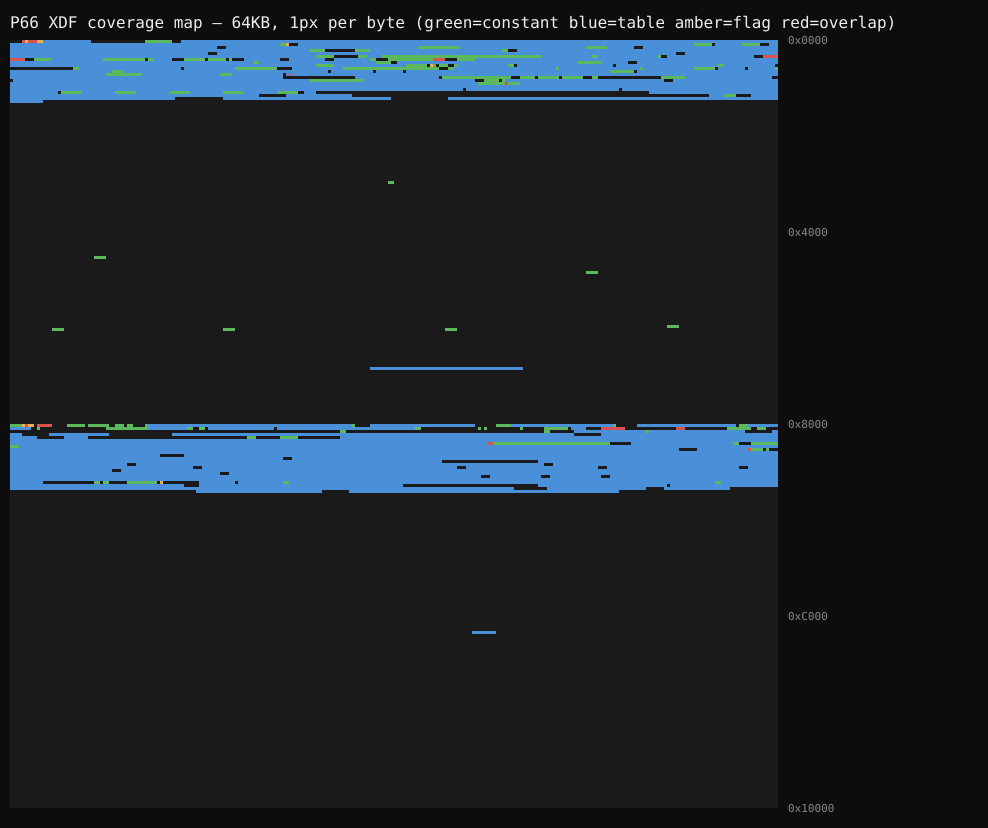

# XDF Audit — Robert Saar P66 V6 vs stock 1995 Camaro L32 bin

Auditor: `tools/xdf-audit.js`
(`node tools/xdf-audit.js <file.xdf> <file.bin> [--json out.json] [--map out.svg] [--min-gap 16]`)

Coverage map:  (blue=tables, green=constants, amber=flags, red=overlaps, dark=undefined)

## Verdict: the XDF is structurally clean

- **1,045 definitions** (285 tables, 571 constants, 227 flags)
- **0 out-of-range** — every definition points inside the 64KB image
- **Coverage: 9,807 / 65,536 bytes (15.0%)** — the rest is code and genuinely
  undefined data, which is expected for a full 64KB image
- **12 overlapping regions, 11 benign:**
  - Bit-flag definitions sharing their parent byte (B0/B1/… of the same address) — normal
  - Multiple MALF CODE definitions sharing DTC status bytes — normal
  - **1 worth a look:** `0xB5D` — constant "Multec Injector Fixing Factor" sits on
    row 1 of the 255-row "Injector Offset vs Low BPW" table (0xB5C–0xC5A).
    Probably an intentional annotation of that cell, but worth confirming with Saar.

## Undefined regions worth future reverse-engineering

30 gaps ≥ 16 bytes. Most are code (entropy ≈ 7). The structured ones:

| Address | Size | Entropy | Notes |
|---|---|---|---|
| `0x6DAB` | 4,693 | 1.96 | **Most interesting.** Follows the sensor-normalization tables. Contains repeating `F4 … 03 18 03 18` records, 16-bit `EE xx` ramps, and `02 A5`-filled tables. Looks like DTC parameter blocks + unfilled tables. |
| `0x1272` | 119 | 3.11 | Calibration area, just past Main VE. Structured. |
| `0x1166` | 111 | 3.87 | Calibration area. `FF` padding + `F4`-header records (same family as `0x6DAB`). |
| `0x95F0` | 78 | 4.13 | Structured. |
| `0x8270` | 66 | 4.06 | Structured. |
| `0x6012` | 53 | 4.95 | Structured. |

## How to actually grow the XDF from here

Guessing table boundaries from one binary is unreliable. The reliable path:

1. **BCC-diff two different calibrations** (`tools/bcc-diff.js`). Bytes that differ
   between BCCs are calibration; bytes that don't are code. Any differing byte
   inside an audit "gap" is an undiscovered table cell.
2. Cross-reference the differing addresses against the gap list above —
   `0x6DAB` is the prime candidate.
3. Propose new definitions back to the XDF (or a supplement XDF) only once a
   second binary confirms the region is calibration.

No invented definitions were added by this audit — the XDF needed verification,
not guesses.
